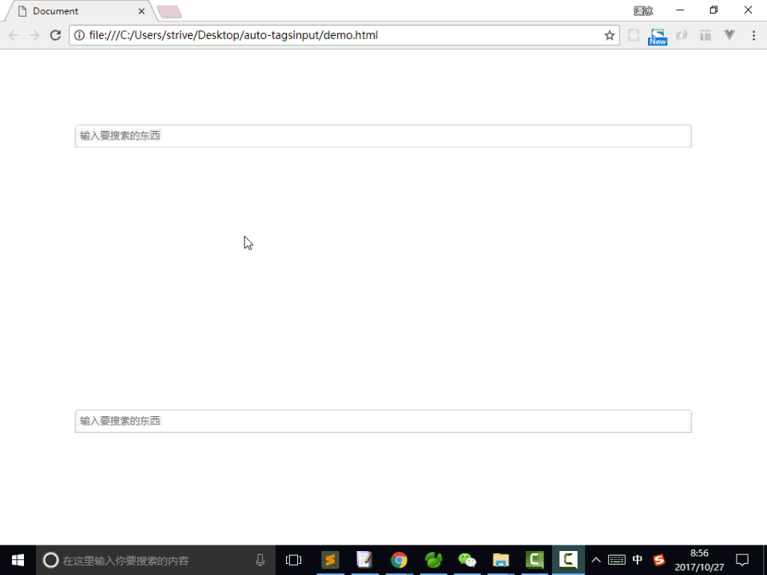

效果图如下:




使用说明:

1. 引入需要的文件

   ```html
   <link rel="stylesheet" href="css/hy-autocomplete.css">
   <script src="js/hy-autocomplete.js"></script>
   ```

2. 编写相应的html

   ```html
   <div class="hy-autocomplete-box" id="hy-autocomplete-box">
   	<ul class="hy-item-list">
   		<li class="hy-input-item">
   			<input type="text" class="hy-input" placeholder="输入要搜索的东西">
   		</li>
   	</ul>
   	<ol class="hy-show-list"></ol>
   </div>
   ```

   > 这里可以加自己的class，修改成自己喜欢的样式(皮肤)
   >
   > 但是注意: 不能删掉以 'hy-' 开头的class，这个是框架需要的hook(钩子标记)

3. 调用js—注意事项

   > 必须确保此js在dom节点渲染完后执行
   >
   > - 可以把调用js放到body最后
   > - 或者 代码放到onload 之后
   > - 或者 代码放到 domReady之后

   ```javascript
   //调用的时候需要闭包包装起来
   ;(function(){
     //这里放入执行代码
   })()
   ```

   ​

4. 完整调用

   ```javascript
   	(function(){
   		var dupArr=[];  //保证tagsinput不能重复，所以需要给框架传入一个干净的空间
   		hyAutoComplete({
   			input:'#hy-autocomplete-box .hy-input',
   			url:'http://120.55.119.118:8088/oneseason-web-boss/demo/list.do',
   			keyname:'kw', //给后台的搜索关键词的 key
   			cbName:'callback',
   			success:function(aaa){
   				hyAutoComplete.renderDOM({
   					renderBox:'#hy-autocomplete-box',
   					data:aaa,
   					fnClick:function(data){
   						alert(JSON.stringify(data));

   						data.input.value='';
   					},
   					fnClose:function(data){
   						alert(JSON.stringify(data));
   					},
   					fnDup:function(data){
   						alert(data.id+',已经添加过了^_^');
   					},
   					dupArr:dupArr
   				})
   			}
   		})
   	})();
   ```

5. API:

   | 名称                                | 说明       |
   | --------------------------------- | -------- |
   | hyAutoComplete(json)              | 向服务器请求数据 |
   | hyAutoComplete.renderDOM(options) | 页面渲染节点   |

   json:(hyAutoComplete函数接收的参数)
   | 参数      | 说明             | 类型       |
   | ------- | -------------- | -------- |
   | input   | 输入框选择器         | string   |
   | url     | 后台接口地址         | string   |
   | keyname | 给后台的搜索关键词的 key | string   |
   | cbName  | callback的名称    | string   |
   | success | 请求数据成功的回调      | function |

   options:(hyAutoComplete.renderDOM接收的参数)
   | 参数        | 说明                                       | 类型       |
   | --------- | ---------------------------------------- | -------- |
   | renderBox | 整个组件的id(这里就是 class为 .hy-autocomplete-box的id) | string   |
   | data      | 渲染到页面的数据，格式必须是 [{id:1, value:11 }....]   | array    |
   | fnClick   | 点击渲染列表某一个项的事件回调                          | function |
   | fnClose   | 关闭标签的事件回调                                | function |
   | fnDup     | 点击重复的事件回调                                | function |
   | dupArr    | 去重的全新数组，需要外界传入                           | array    |

   其他:
   | 名称           | 说明                                       |
   | ------------ | ---------------------------------------- |
   | success 回调函数 | success:function(data){//data}           |
   | fnClick      | fnClick:function(data){data.id, data.value, data.input} |
   | fnClose      | fnClose:function(data){data.id, data.value} |
   | fnDup        | fnDup:function(data){data.id, data.value} |